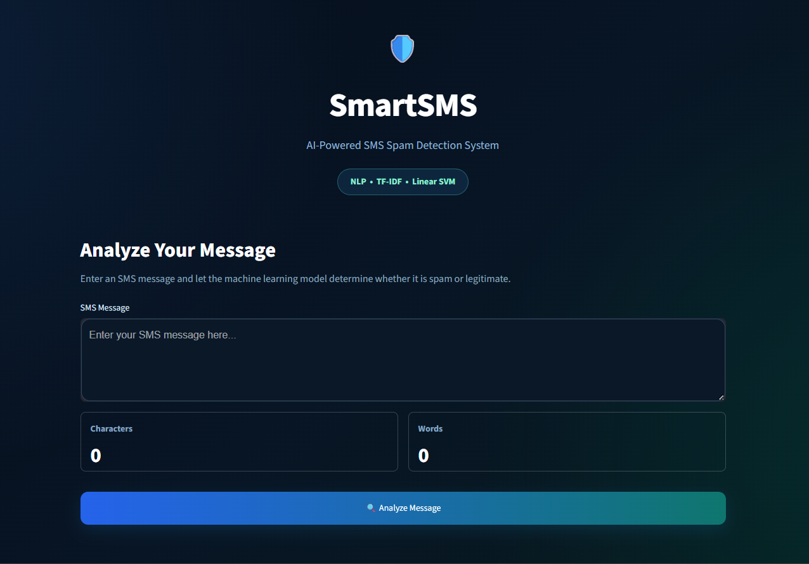
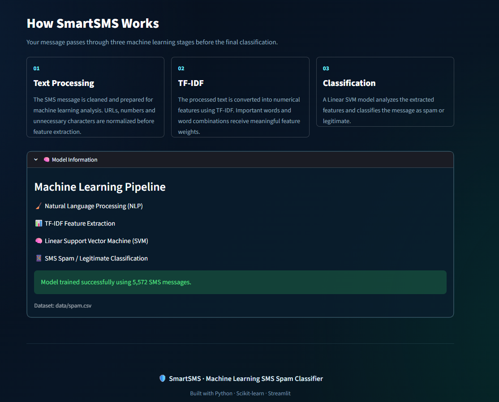
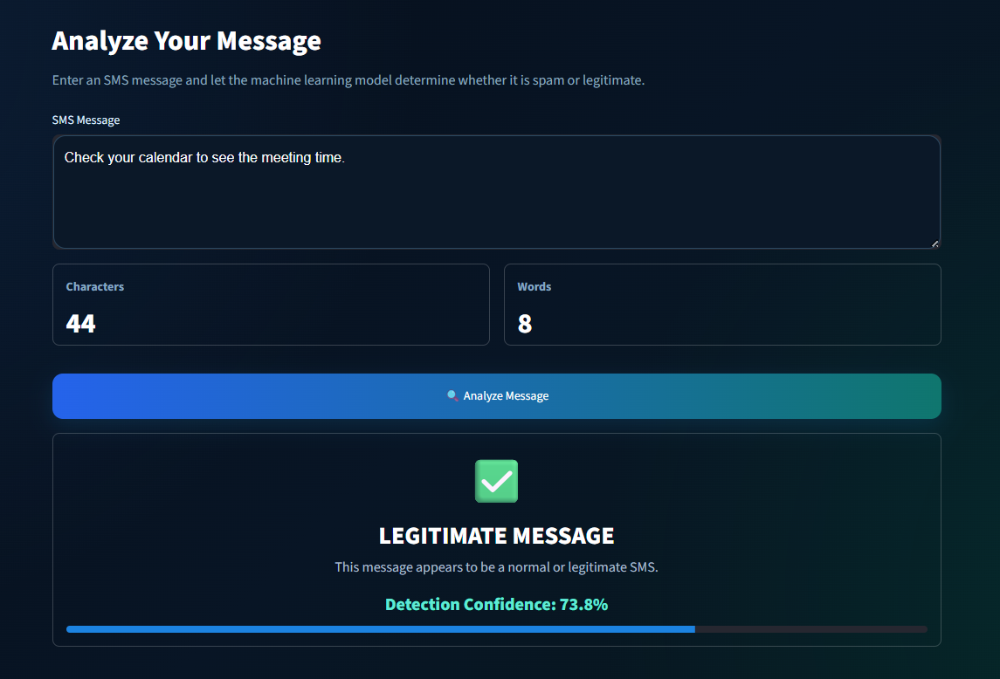
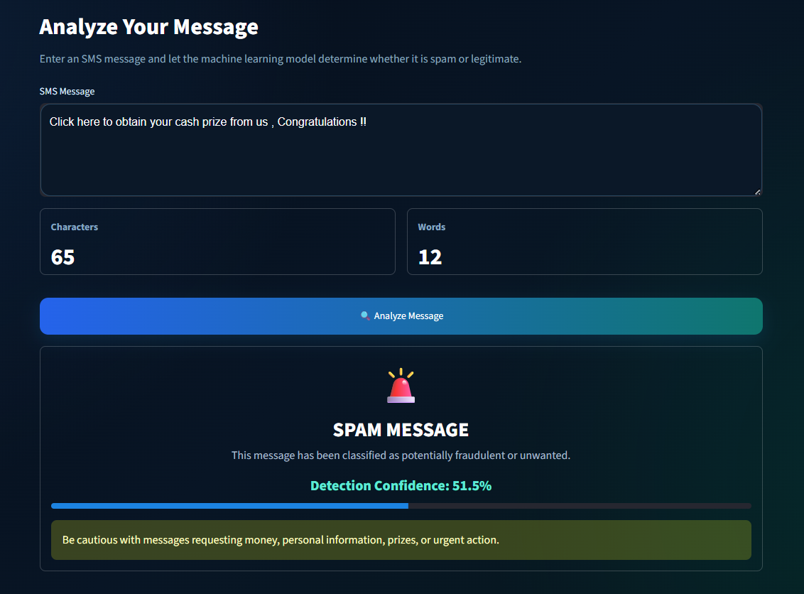

# 🛡️ SmartSMS — AI-Powered SMS Spam Detection

SmartSMS is a machine learning-based web application that classifies SMS messages as either **spam** or **legitimate (ham)**.

The application uses **Natural Language Processing (NLP)** techniques to preprocess SMS text, **TF-IDF** for feature extraction, and a **Linear Support Vector Machine (Linear SVM)** to perform the final classification.

Users can enter an SMS message through the Streamlit web interface and receive an instant classification result along with the model's decision score.


## 📌 Project Overview

SmartSMS is a machine learning-based SMS spam detection system.

The application accepts an SMS message from the user, processes the text using Natural Language Processing techniques, transforms the message into numerical features using a trained TF-IDF vectorizer, and uses a trained machine learning model to classify the message as either:

- 🟢 **Ham** – legitimate SMS
- 🔴 **Spam** – unwanted or potentially harmful SMS

The trained model and TF-IDF vectorizer are stored in the `models/` directory and are used by the Streamlit application for real-time prediction.


## 🌐 Live Demo

🔗 **[Launch SmartSMS Spam Detector](https://smartsms-spam-classifier.streamlit.app)**


## ✨ Features

- 🛡️ **SMS Spam Detection** — Classifies an SMS message as **Spam** or **Legitimate** using machine learning.
- 📝 **Message Analysis** — Provides an interactive interface where users can enter an SMS message for analysis.
- 🔢 **Message Statistics** — Displays the number of **characters** and **words** in the entered message.
- 🧹 **Text Processing** — Cleans and prepares the SMS message before machine learning analysis.
- 📊 **TF-IDF Feature Extraction** — Converts the processed text into numerical features using TF-IDF.
- 🤖 **Linear SVM Classification** — Uses a Linear SVM model to analyze the extracted features and classify the message.
- 🧠 **Model Information** — Provides information about the machine learning approach used by SmartSMS.
- ⚡ **Interactive Streamlit Interface** — Provides a simple web interface for real-time SMS spam analysis.


## 🖥️ Application Interface

SmartSMS provides an interactive Streamlit web interface for entering SMS messages, testing example messages, viewing model performance, and receiving spam or legitimate (ham) predictions.


### Home Page



### Main Interface



### Legitimate Message Prediction



### Spam Message Detection




### 🧠 Machine Learning Approach

SmartSMS follows a simple Natural Language Processing and machine learning pipeline:

```text
SMS Message
    ↓
Text Preprocessing
    ↓
TF-IDF Feature Extraction
    ↓
Linear SVM Classifier
    ↓
Spam / Legitimate Prediction
```

## 📊 Model Performance

The trained Linear SVM model achieved the following performance on the evaluation dataset:

| Metric | Score |
|---|---:|
| **Accuracy** | **97.97%** |
| **Precision** | **97.41%** |
| **Recall** | **86.26%** |
| **F1 Score** | **91.50%** |

These metrics provide an overview of how well the model distinguishes between spam and legitimate SMS messages.

- **Accuracy** — Overall percentage of correctly classified messages.
- **Precision** — How many messages predicted as spam were actually spam.
- **Recall** — How many actual spam messages were correctly detected.
- **F1 Score** — Harmonic mean of precision and recall.


## 🤖 Model Information

SmartSMS uses a Natural Language Processing and machine learning pipeline to classify SMS messages as spam or legitimate.

### Model Pipeline

```text
SMS Message
     ↓
Text Preprocessing
     ↓
TF-IDF Feature Extraction
     ↓
Linear SVM Classifier
     ↓
Spam / Legitimate Prediction
```


## 🛠️ Technologies Used

### Programming Language
- **Python**

### Machine Learning & NLP
- **Scikit-learn**
- **TF-IDF Vectorization**
- **Linear Support Vector Machine (SVM)**

### Data Processing
- **Pandas**
- **NumPy**
- **NLTK**

### Model Persistence
- **Joblib**

### Web Application
- **Streamlit**

### Development Environment
- **Jupyter Notebook**
- **Visual Studio Code**
- **Python Virtual Environment (`venv`)**


## 📁 Project Structure

```text
SmartSMS-spam-classifier/
│
├── data/
│   └── spam.csv
│
├── models/
│   ├── spam_model.pkl
│   └── tfidf_vectorizer.pkl
│
├── notebooks/
│   ├── Spam_Classification_original.ipynb
│   └── Spam_Classification_v2.ipynb
│
├── src/
│   ├── __init__.py
│   ├── preprocessing.py
│   ├── train.py
│   └── predict.py
│
├── app.py
├── requirements.txt
├── .gitignore
└── README.md
```

### 📂 Folder and File Description

- **`data/`** — Contains the SMS dataset used for the project.
- **`models/`** — Contains the trained Linear SVM model and TF-IDF vectorizer.
- **`notebooks/`** — Contains the original course notebook and the developed version of the notebook.
- **`src/`** — Contains the reusable Python modules for preprocessing, model training, and prediction.
- **`app.py`** — Streamlit application that provides the web interface.
- **`requirements.txt`** — Lists the Python packages required to run the project.
- **`.gitignore`** — Specifies files and folders that should not be tracked by Git.
- **`README.md`** — Project documentation.


## 🚀 Installation & Setup

### 1. Clone the Repository

```bash
git clone https://github.com/SuhanyaBinali/SmartSMS-spam-classifier.git

```


## 🔮 Future Improvements

Possible improvements include:

- Improve model performance with additional training data.
- Compare multiple machine learning algorithms.
- Add confidence/probability visualization.
- Improve the user interface.
- Add prediction history.
- Continuously update the training dataset with newer spam patterns.


## 👩‍💻 Author

**Suhanya Binali Wanniarachchi**

SmartSMS – AI-Powered SMS Spam Detectiongit add README.md


## 📄 License

This project is licensed under the MIT License. See the [LICENSE](LICENSE) file for more details.


